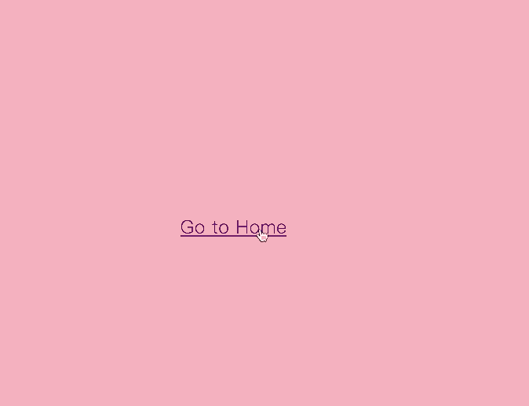

# react_mojs_brust_example

mo-js brust example build with react and react router, when router change, it will animate



[demo](https://chnbohwr.github.io/react_mojs_brust_example/#/)

# how to run on local

```
git clone https://github.com/chnbohwr/react_mojs_brust_example
cd react_mojs_brust_example
npm install
npm start
```
